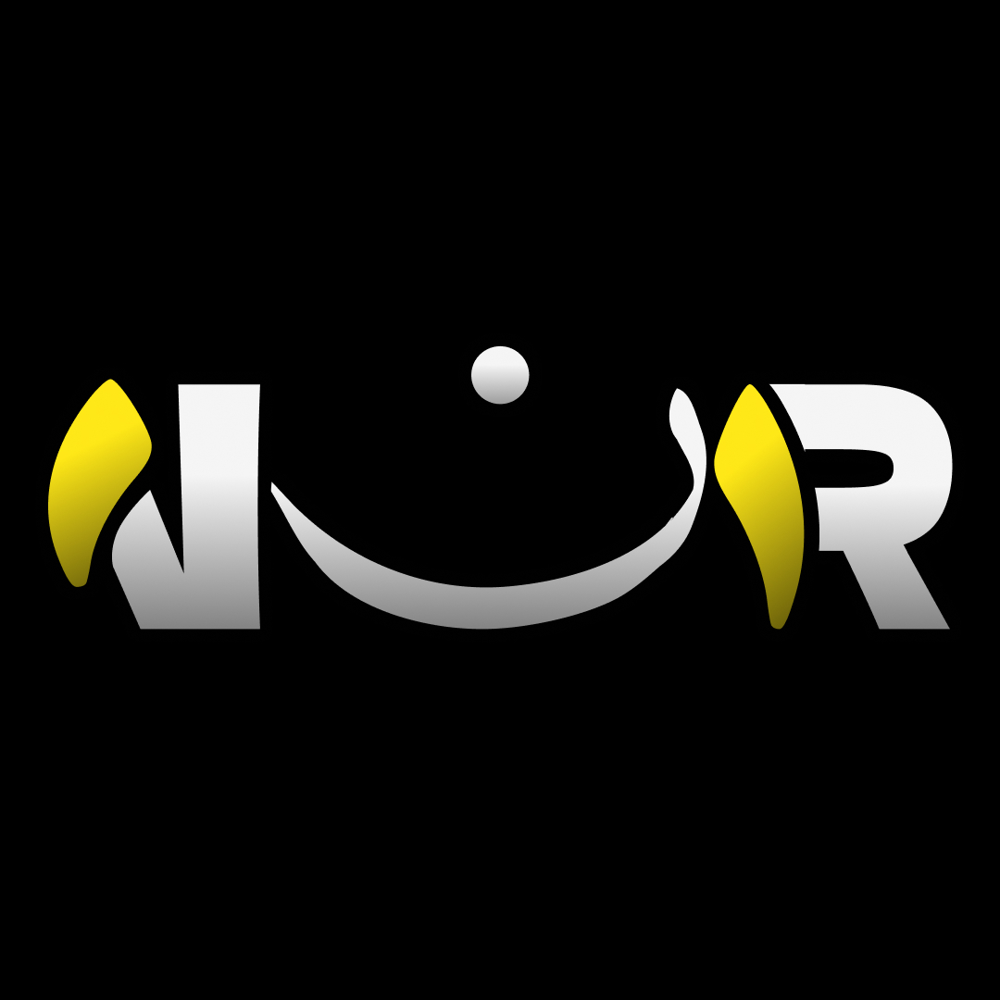

## Sobre 1nor.es

1nor.es es nn espacio digital creado para difundir el conocimiento auténtico sobre el Islam, resolver dudas, y ofrecer herramientas interactivas para acercarse al Creador.

Nuestra plataforma facilita el acceso a información verificada, con herramientas como:

- [Respuestas Auténticas](https://1nor.es) - Consultas religiosas verificadas por eruditos.
- [Verificación de Contenido](https://1nor.es) - Corrección de información errónea sobre el Islam.
- [Tawheed Quiz](https://1nor.es) - Cuestionarios interactivos sobre la unicidad de Allah.
- [Guía Islámica](https://1nor.es) - Recursos esenciales para nuevos musulmanes.
- [Es-Bidaa](https://1nor.es) - Explicación sobre la Bid'ah y su impacto en la religión.
- [Recursos para Dawah Digital](https://1nor.es) - Consejos y herramientas para el activismo islámico online.

1nor.es es accesible, poderosa y proporciona los medios necesarios para una Dawah digital efectiva y basada en conocimientos auténticos.

## Aprende más

Para profundizar en nuestro trabajo y aprovechar al máximo nuestra plataforma, consulta nuestros recursos disponibles en [1nor.es](https://1nor.es).

También puedes contribuir al proyecto colaborando en GitHub, reportando problemas o proponiendo mejoras en nuestros repositorios.

¡Que Allah te recompense por tu interés en la Dawah! 🤲
